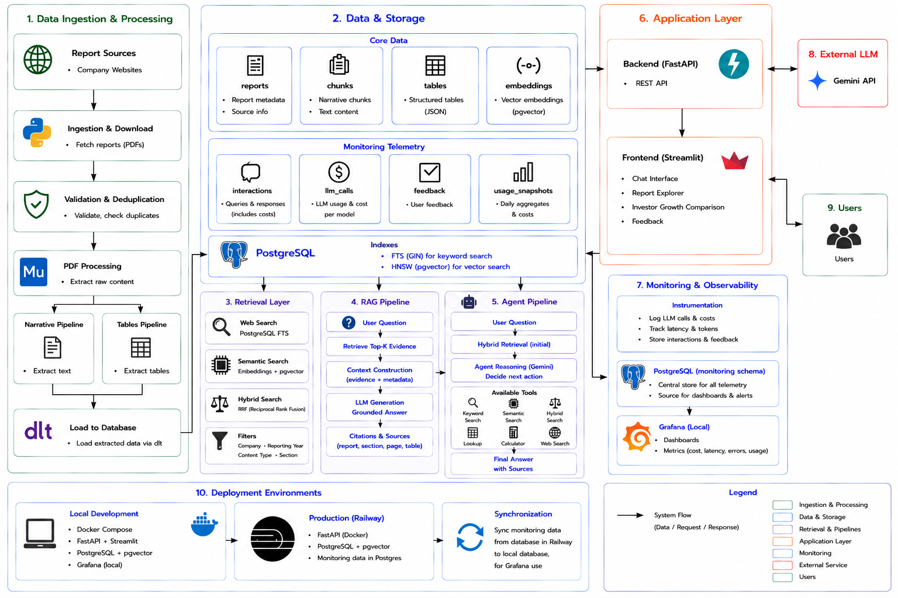
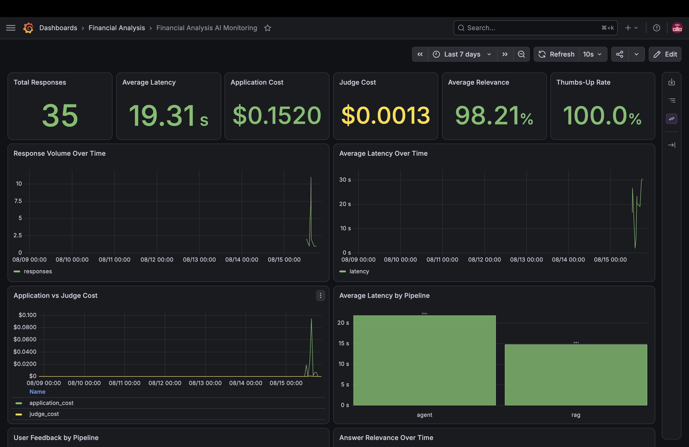
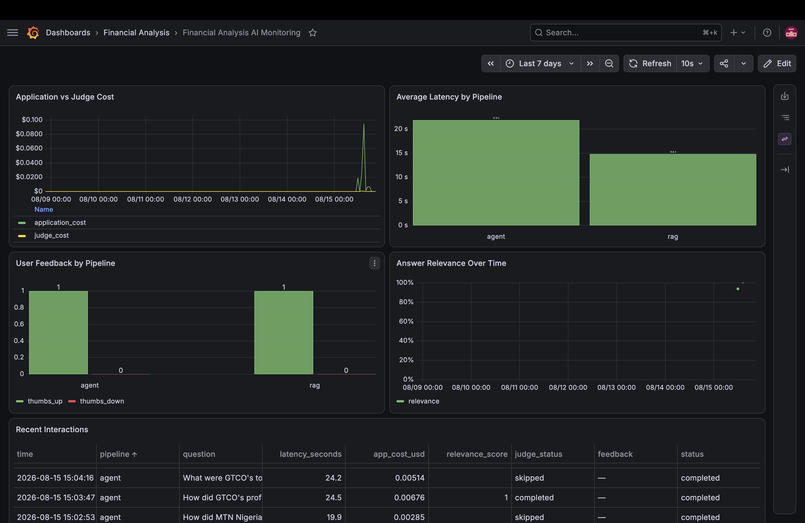
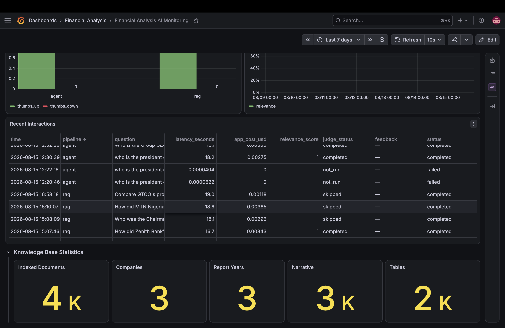

# Nigeria Stock Financial Analysis Project

An AI-powered financial analysis application for exploring and analysing
Nigerian companies' annual reports using RAG and agentic workflows.

[🚀 Launch the App](https://dara-fin.streamlit.app/)

## Table of Contents

1. [Introduction](#introduction)
2. [Problem Statement](#problem-statement)
3. [Features](#features)
4. [System Architecture](#system-architecture)
5. [Technology Stack](#technology-stack)
6. [LLMOps and Engineering Practices](#llmops-and-engineering-practices)
7. [Monitoring and Observability](#monitoring-and-observability)
8. [Generative AI Use Declaration](#generative-ai-use-declaration)
9. [Other Zoomcamp Projects](#other-zoomcamp-projects)
10. [Acknowledgements](#acknowledgements)
11. [References](#references)

## Introduction

This project is my final project for the DataTalks.Club [LLM Zoomcamp](https://github.com/DataTalksClub/llm-zoomcamp), an online bootcamp focused on building applications with Large Language Models (LLMs).

The LLM Zoomcamp is the **fourth DataTalks.Club Zoomcamp** I have taken, following the **Data Engineering Zoomcamp, Machine Learning Zoomcamp, and MLOps Zoomcamp**. Rather than treating the lessons from these programmes independently, I adapted relevant engineering practices from them to build this project as an end-to-end financial analysis LLM application.

The Zoomcamp tutorials were originally developed using OpenAI models. I followed the course using **Gemini instead**, both to reduce API costs and to deepen my understanding by adapting the course material to a different LLM provider.

If you would like to follow the LLM Zoomcamp using the **Gemini API**, you can find my adapted course materials here:

[**Gemini LLM Zoomcamp Course Materials**](https://github.com/darasiemi/LLMzoomcamp)

## Problem Statement

I started this project after recognising a gap in my own financial knowledge. I wanted to better understand how to evaluate companies, interpret financial reports, and make investment decisions based on analysis.

This is not an isolated challenge. Financial literacy remains a significant issue in Nigeria: an EFInA survey cited by the International Monetary Fund (IMF) found that **more than half of Nigerian adults have limited financial literacy and capability**, particularly in financial planning [[1]](https://www.elibrary.imf.org/view/journals/002/2023/094/article-A003-en.xml?utm_source=chatgpt.com). The Central Bank of Nigeria similarly recognises that many Nigerians lack the skills required to effectively manage their finances and take advantage of financial products and opportunities [[2]](https://www.cbn.gov.ng/FinInc/FinLit/).

Yet, making informed investment decisions often requires reading lengthy annual reports, comparing financial performance across years, identifying relevant metrics, and understanding the wider context behind the numbers.

**Financial Analysis AI** was built to make this process more accessible. It uses retrieval-augmented generation (RAG) and agentic workflows to analyse company annual reports, answer financial questions with supporting evidence, explore financial tables, and compare company performance.

The initial implementation focuses on **MTN Nigeria, Guaranty Trust Holding Company (GTCO), and Zenith Bank** as a starting point. However, the underlying ingestion, retrieval, and analysis architecture is designed to be extensible to other companies listed on the **Nigerian Exchange (NGX)**.

Ultimately, the goal is not to automate investment decisions, but to **improve financial literacy and support more informed, evidence-based investment analysis**.

## Features

Financial Analysis AI is designed to help users explore company financial reports, understand financial performance, and conduct evidence-based analysis with **page-level source citations**, reducing the need to manually search through hundreds of pages of annual reports.

With the application, users can:

### Ask Questions About Annual Reports

You can ask questions in natural language, such as:

> What was GTCO's profit before tax in 2023?

The application searches the available annual reports and generates an answer based on the information it finds.

### Evidence-Grounded Answers

Answers are supported by evidence retrieved from the underlying annual reports, allowing users to see where the information came from rather than relying solely on the AI's response.

### Search by Company and Year

Users can narrow their analysis to a particular company or reporting year. The initial collection includes:

- MTN Nigeria
- Guaranty Trust Holding Company (GTCO)
- Zenith Bank

### RAG and Agent Analysis

Users can choose between two analysis approaches:

- **RAG** — retrieves relevant information from annual reports and uses it to answer the question.
- **Agent** — dynamically selects the appropriate tools for complex financial questions.

### Agent Tools

For more complex questions, the Agent can use several specialised tools:

| Tool | What it does |
|---|---|
| **Keyword Search** | Finds information containing specific financial terms, names, or phrases in annual reports. |
| **Semantic Search** | Finds relevant information based on meaning, even when the report uses different wording from the user's question. |
| **Hybrid Search** | Combines keyword and meaning-based search to improve the chances of finding the right evidence. |
| **Table Lookup** | Examines extracted financial tables to find specific figures, rows, columns, and values. |
| **Calculator** | Performs deterministic calculations on financial figures, avoiding reliance on the LLM for arithmetic. |
| **Web Search** | Searches the web when a question requires current or external information that is not available in the knowledge base. |
| **PowerPoint Generation** | Creates a PowerPoint presentation from the financial analysis when requested by the user. |

The Agent can select and combine these tools depending on the question instead of requiring the user to decide which search method to use.

### Compare Financial Information

Users can ask questions that require comparing financial information across companies, metrics, or reporting periods, helping them explore changes in company performance over time.

### Explore Financial Tables

The system separately processes financial tables from annual reports, making it possible to retrieve information from structured financial statements as well as narrative sections of the reports.

### Source Prioritisation

When analysing a question, the Agent prioritises information in the following order:

1. Company annual reports
2. Extracted financial tables
3. Deterministic calculations
4. Public web information

This keeps analysis grounded in company-reported information whenever possible.

### Interactive Web Application

The Streamlit interface provides a simple way to submit questions, select analysis options, review answers and supporting evidence, and interact with the financial analysis system without needing to write code.

### User Feedback

Users can provide **thumbs-up or thumbs-down feedback** on responses. This feedback is recorded separately from automated quality measurements and can be used to understand how useful users find the generated answers.

<!-- ffmpeg -i media/streamlit-app-video.webm media/streamlit-app-video.gif -->
## System Architecture

The system follows an end-to-end LLM application architecture, from annual report ingestion and processing to retrieval, RAG and agentic analysis, deployment, and monitoring. PostgreSQL with pgvector provides the central data layer, while FastAPI serves the backend, Streamlit provides the user interface, and Gemini powers the RAG and agent workflows.

For more details:

- **[System Architecture](SYSTEM.md)** — Detailed documentation of the data ingestion, storage, retrieval, RAG and agent pipelines, deployment, monitoring, and system design decisions.
- **[Setup Guide](SETUP.md)** — Instructions for installing dependencies, configuring the environment, ingesting data, running the application, testing, evaluation, and monitoring.
- **[Evaluation](evaluation/README.md)** — Details on benchmark generation and the evaluation of retrieval and answer quality for the RAG and agent pipelines.

## Technology Stack

The project combines data engineering, retrieval, LLM application development, deployment, evaluation, and observability technologies.

| Area | Technologies | Purpose |
|---|---|---|
| **Programming Language** | Python | Core application, ingestion, retrieval, RAG, agent, evaluation, and monitoring logic |
| **Dependency Management** | `uv` | Python dependency and environment management |
| **Data Ingestion** | `requests`, Playwright | Downloading company annual reports |
| **PDF Processing** | PyMuPDF | Extracting and processing narrative content from annual reports |
| **Data Loading** | `dlt` | Loading processed financial-report data into PostgreSQL |
| **Database** | PostgreSQL | Storing report content, metadata, structured tables, and monitoring telemetry |
| **Vector Database** | pgvector | Storing embeddings and performing vector similarity search within PostgreSQL |
| **Embeddings** | SentenceTransformers | Generating embeddings for semantic retrieval |
| **Keyword Retrieval** | PostgreSQL Full-Text Search | Lexical search over financial-report content |
| **Hybrid Retrieval** | Reciprocal Rank Fusion (RRF) | Combining keyword and semantic search results |
| **LLM** | Gemini API | RAG answer generation, agent reasoning, and LLM-based evaluation |
| **RAG** | Custom Python pipeline | Evidence-grounded question answering over annual reports |
| **Agentic AI** | Gemini tool calling + custom tools | Financial analysis using retrieval, table lookup, calculation, web search, and presentation generation |
| **Backend** | FastAPI, Uvicorn | API layer and orchestration of RAG and agent pipelines |
| **Frontend** | Streamlit | Interactive financial analysis interface |
| **Evaluation** | Custom evaluation pipeline | Benchmark generation and retrieval/answer quality evaluation |
| **Monitoring & Observability** | Grafana, PostgreSQL | Monitoring latency, costs, token usage, relevance, feedback, and application behaviour |
| **Containerisation** | Docker, Docker Compose | Reproducible local database and monitoring services |
| **Deployment** | Railway | Production hosting for the FastAPI backend and PostgreSQL |
| **Testing** | pytest | Smoke and integration testing |
| **Code Quality** | Black, isort, Pylint | Formatting, import ordering, and static code analysis |
| **Development Automation** | GNU Make, pre-commit | Standardised development workflows and automated quality checks |
| **Notebooks** | Jupyter Notebook | Exploration and development analysis |
| **Version Control** | Git, GitHub | Source control and project hosting |

## LLMOps and Engineering Practices

The project applies concepts from the LLM Zoomcamp to build **RAG and agentic pipelines for analysing Nigerian companies' annual reports**. I have extended the project beyond the core LLM Zoomcamp requirements by applying lessons and engineering practices I gained from my previous **Data Engineering, Machine Learning, and MLOps Zoomcamps**. In particular, I adapted MLOps principles to the LLM lifecycle, incorporating **LLMOps practices** including:

- **Data pipelines** for ingesting, validating, processing, chunking, and storing financial reports and tables.
- **Retrieval infrastructure** combining keyword, semantic, and hybrid search with PostgreSQL and pgvector.
- **RAG and agentic pipelines** for grounded financial question answering, tool use, and source citation.
- **Evaluation pipelines** for generating benchmark datasets and evaluating retrieval and answer quality.
- **LLM observability** for tracking interactions, model calls, token usage, latency, and application costs.
- **Monitoring** with PostgreSQL and Grafana dashboards for application and LLM metrics.
- **Deployment** of the FastAPI backend, Streamlit frontend, and PostgreSQL database using Docker and Railway.
- **Security practices** including environment-based secret management, private production database access, and temporary SSH tunnelling for secure access to production monitoring data.
- **Testing and software quality** through smoke and integration tests, linting, formatting, pre-commit hooks, and reproducible Makefile commands.
- **Reproducible development environments and dependency management** using `uv` and Docker.
- **Production-to-local monitoring workflows** for analysing production telemetry locally in Grafana.

The result is not only an LLM application, but an attempt to apply the **end-to-end engineering lifecycle to LLM systems**: from data ingestion and retrieval to evaluation, deployment, monitoring, and continuous code-quality practices.

## Observability

The application includes an observability layer for monitoring how the system behaves during use. Application telemetry is stored in PostgreSQL and visualised through Grafana, providing visibility into system usage, performance, LLM costs, response quality, and user feedback.

The dashboards help monitor metrics such as response volume, latency, application and evaluation costs, answer relevance, and user feedback.

### Performance and Cost Monitoring

### Interaction Monitoring

### Knowledge Base Statistics

> Grafana is currently run locally, while production telemetry is stored in Railway PostgreSQL and can be synchronised to the local PostgreSQL database for analysis. Also, token usage is logged for each LLM call in the database, although it is not currently visualised in a dedicated Grafana panel.

## Generative AI Use Declaration

Generative AI was used as a **development and learning aid** during the implementation of this project. I primarily interacted with AI through conversational chat interfaces to discuss implementation approaches, troubleshoot problems, clarify technical concepts, and generate or refine portions of code.

I **did not use autonomous or automated AI coding agents** to independently modify the repository or implement features on my behalf. Where AI-generated code was used, I manually copied and pasted it into the codebase. This kept the development process under my direct control and allowed me to review the generated code, understand how it fitted into the wider system, and make changes where necessary.

This workflow also meant that generated code did not automatically translate into working software. I encountered implementation errors, integration issues, unexpected behaviour, and bugs while running the code. I used these problems as opportunities to investigate the underlying behaviour, ask follow-up questions, consult relevant documentation where necessary, and develop a deeper understanding of the technologies and design decisions involved. All git commits and push were 100% made by me. 

AI assistance was used for activities including:

- discussing system architecture and implementation approaches;
- generating and refining code snippets;
- debugging errors and investigating unexpected behaviour;
- explaining unfamiliar libraries, APIs, algorithms, and engineering concepts;
- reviewing implementation choices and considering alternatives;
- developing and refining database, retrieval, RAG, agentic, evaluation, deployment, and monitoring components;
- improving technical documentation and code readability; and
- assisting with test design and interpretation of results.
- generating and refining the system architecture diagram
- refining the markdown such as `README.md`, `SETUP.md`, `SYSTEM.md`.

I remained responsible for integrating and executing the code, configuring the development and deployment environments, validating system behaviour, and making the final technical and architectural decisions.

To support maintainability and code quality, I also established automated **formatting, linting, testing, and pre-commit checks** (concepts I learnt from the MLOps Zoomcamo) within the development workflow. These checks help identify formatting inconsistencies, code-quality issues.

## Other Zoomcamp Projects

This is my fourth DataTalks.Club Zoomcamp. Each Zoomcamp has contributed to a different part of my understanding of the end-to-end data, machine learning, and AI engineering lifecycle, and I have carried lessons and engineering practices from these earlier projects into this project.

| Zoomcamp | Project | Focus |
|---|---|---|
| **Data Engineering Zoomcamp** | [Project on Fraud Data and Analysis](https://github.com/darasiemi/data_engineering_credit_fraud_project) | Data ingestion, transformation, orchestration, data warehousing, and analytics engineering |
| **Machine Learning Zoomcamp** | [Project 1 on Food Preparation Time Prediction ](https://github.com/darasiemi/food-preparation-time-prediction-project) | Machine learning model development, evaluation, and deployment with AWS ELastic Beanstalk |
| **Machine Learning Zoomcamp** | [Project 2 on Sleep Quality Prediction ](https://github.com/darasiemi/sleep-quality-prediction) | Machine learning model development, evaluation, and deployment with Kubernetes|
| **MLOps Zoomcamp** | [Project on Stress Prediction using Multimodal Inputs](https://github.com/darasiemi/mental_health_mlops_project) | Experiment tracking, orchestration, deployment, monitoring, testing, infrastructure, and reproducible ML |
| **LLM Zoomcamp** | **This Project** | RAG, agentic workflows, evaluation, LLMOps, deployment, monitoring, and observability |

Together, these projects reflect my progression across **data engineering → machine learning → MLOps → LLM and AI engineering**, with each Zoomcamp allowing me to build on concepts and engineering practices learned in the previous ones.

## Acknowledgements

I would like to thank [DataTalks.Club](https://datatalks.club/) and its community for the excellent open learning resources they provide. Their courses have played an important role in developing my practical understanding of machine learning engineering and the end-to-end process of building production-oriented AI systems, providing valuable insights into the potential real-world implementation and deployment of my PhD research.

In particular, the hands-on and project-focused nature of the courses helped me connect concepts across data engineering, machine learning, LLM applications, deployment, testing, monitoring, and MLOps. Many of the engineering practices I applied while building this project were strengthened by what I learned through DataTalks.Club.

### AI Engineering

I would also like to acknowledge **Chip Huyen** for her book *AI Engineering: Building Applications with Foundation Models*. Having completed about three-quarters of the book, it has helped me deepen my understanding of AI engineering and reinforce many of the concepts and engineering practices introduced throughout the Zoomcamps. The book has been particularly valuable in connecting these lessons to the broader principles and challenges involved in building production-ready AI systems.

  

  <em>AI Engineering: Building Applications with Foundation Models — Chip Huyen</em>

## References

1. International Monetary Fund (2023). [*Nigeria—Fostering Financial Inclusion Through Digital Financial Services*](https://www.elibrary.imf.org/view/journals/002/2023/094/article-A003-en.xml?utm_source=chatgpt.com). *IMF Selected Issues Papers*, 2023(020).

2. Central Bank of Nigeria. [*Financial Literacy*](https://www.cbn.gov.ng/FinInc/FinLit/).

[⬆ Back to Top](#nigeria-stock-financial-analysis-project)

---

**Project Version:** August 2026

